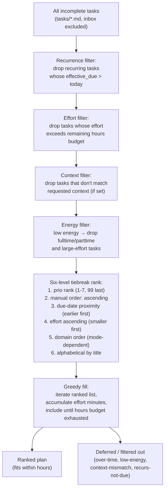

# Ranking

`agentic-gtd` uses a deterministic six-key tiebreak chain to produce a total order for every plan.

## Overview

Every task gets a rank derived from `prio`, then refined by due date, effort, domain, and title. The result is the same for any two tasks regardless of the order they appear in the source files. The exact parsing and algorithm are defined in the skill file.

**Source of truth:** [`../../skills/gtd-prioritization/SKILL.md`](../../skills/gtd-prioritization/SKILL.md)

## Ranking Pipeline

The diagram below shows the full daily-mode pipeline: filters are applied first, then tasks are ranked, then the greedy fill selects the final plan.

## Daily vs Weekend Differences

| Aspect | Daily (`/plan-day`) | Weekend (`/plan-weekend`) |
|--------|---------------------|---------------------------|
| Domain tie-break order | fulltime < parttime < side-projects < open-source < knowledge | side-projects < open-source < knowledge < parttime < fulltime |
| Fulltime sectioning | fulltime tasks rank normally | non-overdue fulltime → `## Full-time (optional this weekend)` |
| Weekly Review sweep | not included | runs first; surfaces overdue/stale/incomplete metadata |
| Default hours | 8 | 12 |
| Energy filter | yes (high/med/low) | not applicable |
| Context filter | yes | not applicable |

The **primary sort key** (`prio` rank) is identical in both modes.

## Tiebreak Chain

When two tasks share the same `prio` rank, the plan resolves ties in this order:

1. `prio` rank ascending (NEVER overridden)
2. Manual `order:` ascending — `order:N` tasks sort before untagged tasks within the same prio rank; never crosses rank boundaries
3. Due-date proximity — earlier first; tasks with no due date sort after all dated tasks
4. Effort ascending — smaller effort first; unknown effort sorts last
5. Domain order — per the mode table above; order is registry-driven (`daily_order`/`weekend_order` columns in `tasks/domains.md`); default daily sequence: fulltime < parttime < side-projects < open-source < knowledge
6. Alphabetical by title — guarantees a total order with no ties

## Greedy Time Fill

After ranking, `/plan-day` applies a greedy algorithm to fill the available hours budget: tasks are selected in rank order until the budget is exhausted or no tasks remain. Tasks that do not fit are listed in `## Deferred / filtered out`.

For the full algorithm — including how energy filters modify the rank list and how recurring tasks compute their effective due date — see the skill file linked above.

## Related

- [Priority Ladder](../concepts/priority-ladder.md) — the `prio` rank values
- [Using /plan-day](../guides/using-plan-day.md) — energy and context filter usage
- [Using /plan-weekend](../guides/using-plan-weekend.md) — domain reweighting in weekend mode
