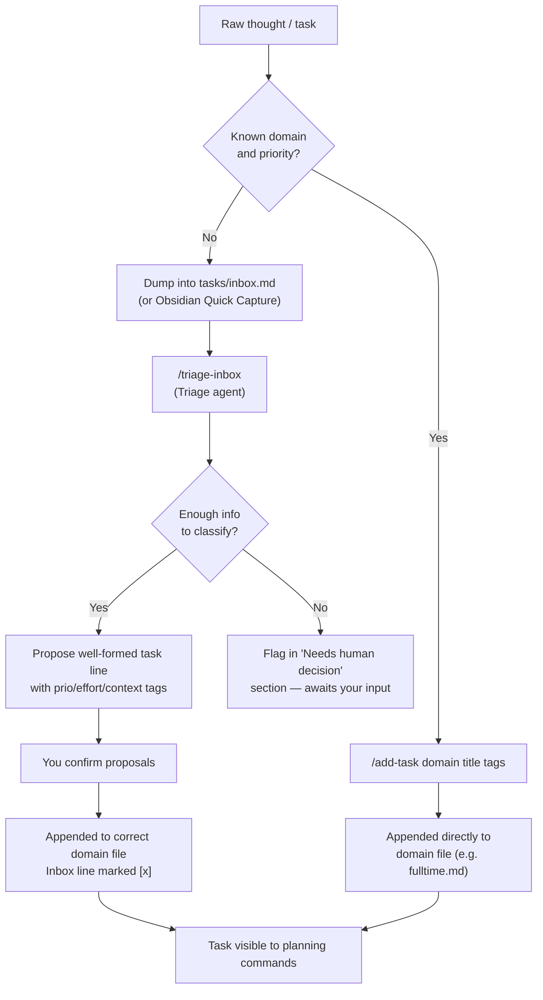

# Capturing Tasks

Add tasks to the system — both direct `/add-task` capture and the inbox-based triage flow.

## Overview

`agentic-gtd` offers two capture paths: `/add-task` for immediate, well-specified tasks and `tasks/inbox.md` for raw, unrefined thoughts that need clarification before becoming plan-eligible.

## Direct Capture with /add-task

Use `/add-task` when you already know the domain, description, and at least a rough priority.

**Source of truth:** [`../../commands/add-task.md`](../../commands/add-task.md)

### Usage

```
/add-task fulltime Write onboarding doc for new team member  prio:long  effort:2h  context:@computer
/add-task side Publish blog post announcing v1.0  prio:side  project:saas-app  effort:1h  due:2026-06-20
/add-task knowledge Read "Shape Up" chapter 2  prio:long  effort:1h
```

### Arguments

| Argument | Required | Description |
|----------|----------|-------------|
| `domain` | Yes (first token) | Any domain registered in `tasks/domains.md`; aliases come from the registry's aliases column. Use `/add-domain` to register a new one. Built-in examples: `fulltime`, `parttime`, `side` / `side-projects`, `oss` / `open-source`, `knowledge` |
| task description | Yes | Free-form text before any `key:value` tags |
| `prio:`, `project:`, `effort:`, `due:`, `context:` | No | Optional tags |

`/add-task` appends exactly one `- [ ] ...` line to the correct domain file. It never reorders or rewrites existing lines.

## Inbox Capture

For raw thoughts, dump them directly into `tasks/inbox.md`. The Triage agent will clarify and file them later. The Obsidian dashboard also provides a **Quick capture** form.

`tasks/inbox.md` is **never** read by planning or sync commands — items there are invisible until triaged.

## Capture-to-Domain Flow

The diagram below shows both capture paths and how items reach a domain file.



## Triage with /triage-inbox

`/triage-inbox` reads every open item in `tasks/inbox.md`, delegates each to the Triage agent for clarification, batches the proposals, and — after you confirm — appends the well-formed task lines to the correct domain files and marks the corresponding inbox lines `[x]` in place.

**Source of truth:** [`../../commands/triage-inbox.md`](../../commands/triage-inbox.md)

### Usage

```
/triage-inbox
```

### Triage Agent Behavior

The Triage agent (see [Triage Agent](../reference/triage-agent.md)):

- Converts raw notes into concrete next-action task lines
- Assigns `prio:` by reasoning about the priority ladder
- Infers domain and appends clarified tasks to the appropriate domain file
- Flags ambiguous items in a `## Needs human decision` section rather than guessing
- Never invents due dates

### Invariants

- `tasks/inbox.md` is append-only — inbox lines are marked `[x]`, never deleted
- The append-only audit trail is always preserved
- Markdown stays the single source of truth throughout

## Obsidian Quick Capture

The Obsidian dashboard includes a **Quick capture** form at the top. Type any raw thought and click "Add to inbox" (or press Enter) — the item is appended to `tasks/inbox.md` immediately. The **Inbox needs triage** section lists all open inbox items.

To run triage from the dashboard: click **"Copy triage command"** — it copies `/triage-inbox` to your clipboard. Paste and run it in Claude Code.

## Related

- [Triage Agent](../reference/triage-agent.md) — full agent specification
- [Task Line Format](../concepts/task-line-format.md) — tag reference
- [Obsidian Dashboard](../guides/obsidian-dashboard.md) — Quick capture form details
