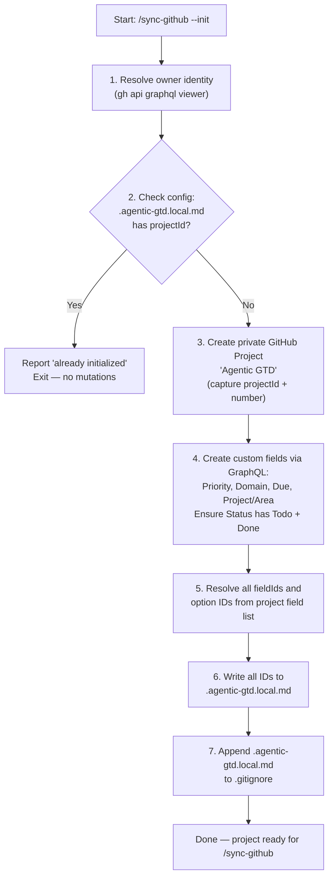

# GitHub Sync

One-way push of all domain tasks into a private GitHub Project v2.

## Overview

`/sync-github` pushes every task from `tasks/*.md` (excluding inbox) into a private GitHub Project, mapping markdown fields to GitHub Project custom fields. Markdown is always the source of truth — sync never pulls from GitHub, never resolves conflicts, and never deletes GitHub items.

**Source of truth for internals:** [`../../skills/github-sync/SKILL.md`](../../skills/github-sync/SKILL.md)

**View-layout reference:** [`../../skills/github-sync/references/view-layout-automation.md`](../../skills/github-sync/references/view-layout-automation.md)

## Prerequisites

- `gh` CLI installed and authenticated: `gh auth login`
- Optional: `personal-github` MCP server configured (used for identity resolution and issue listing)
- Projects v2 field writes use GraphQL via `gh api graphql`

## Commands

```sh
/sync-github --init          # create GitHub Project + fields (idempotent)
/sync-github --init --dry-run  # preview what --init would do
/sync-github                 # sync all tasks
/sync-github --dry-run       # preview sync without mutations
```

## The --init Flow

The following diagram shows the idempotent initialization sequence (steps mirror `skills/github-sync/SKILL.md` exactly).



1. Resolves your GitHub owner identity
2. Checks `.agentic-gtd.local.md` — if `projectId` already set, exits without recreating
3. Creates a private GitHub Project titled "Agentic GTD"
4. Creates custom fields: `Priority` (single-select), `Domain` (single-select), `Due` (date), `Project/Area` (text); ensures Status has `Todo` and `Done` options
5. Resolves and records every `fieldId` and option ID
6. Writes all IDs to `.agentic-gtd.local.md` at repo root
7. Adds `.agentic-gtd.local.md` to `.gitignore`

## Field Mapping

| Markdown source | GitHub Project field | Values |
|-----------------|----------------------|--------|
| filename stem | `Domain` | Domains with `github_sync: yes` in `tasks/domains.md` (built-in: fulltime, side-projects, open-source, knowledge). `parttime` is `github_sync: no` by design. New domains require manually adding a Domain single-select option in the GitHub Project and its option-ID in `.agentic-gtd.local.md` (see `commands/add-domain.md` Step 8); otherwise `/sync-github` skips them with a warning. |
| `prio:` tag | `Priority` | fulltime, trust, side, long, short, tedious |
| `due:` tag | `Due` | YYYY-MM-DD (empty if absent or malformed) |
| checkbox `[ ]` / `[x]` | `Status` | Todo / Done |
| task title | item title | trimmed, whitespace collapsed |
| `project:` tag | `Project/Area` | text (omitted if tag absent) |

## Config File

`.agentic-gtd.local.md` at repo root stores `projectId`, `projectNumber`, `owner`, and all `fieldId` and option ID mappings. **This file must not be committed.** It is added to `.gitignore` during `--init`.

## One-Way Push Invariants

- Markdown is always the source of truth
- Sync never pulls from GitHub, never resolves conflicts, never deletes GitHub items
- `tasks/inbox.md` is never synced
- **Rename limitation:** Renaming a task in markdown creates a duplicate in GitHub. The old item is orphaned (one-way push never deletes). Remove orphans manually in the GitHub Project UI.

## Related

- [Installation](../getting-started/installation.md) — `gh` CLI setup
- [Task Line Format](../concepts/task-line-format.md) — field definitions
