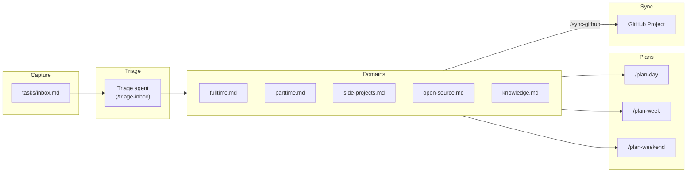

# Agentic GTD

A Claude Code plugin that ingests tasks from local markdown files across configurable domains (five built-in, extensible via `/add-domain`), produces ranked daily and weekend plans using a fixed GTD priority ladder, and one-way syncs tasks into a private GitHub Project.

## Overview

`agentic-gtd` is a GTD-grounded productivity plugin that lives entirely in your local repository. Markdown files are the source of truth. The plugin provides Claude Code commands to build ranked plans, capture tasks, and optionally sync work into a GitHub Project for visibility.

## Key Features

| Feature | Description |
|---------|-------------|
| **Domains** | Five default domains (fulltime, parttime, side-projects, open-source, knowledge), extensible via `/add-domain`; registry in `tasks/domains.md` |
| **Priority ladder** | Seven-tier fixed ranking (`fulltime` → `tedious`); never overridden |
| **Daily plan** | `/plan-day` filters by hours, energy, and context; saves to `tasks/plans/` |
| **Week plan** | `/plan-week` buckets tasks by due date across a 7-day window |
| **Weekend plan** | `/plan-weekend` runs a GTD Weekly Review and reverses domain weighting |
| **Triage agent** | Converts raw inbox items into concrete next-action lines with correct tags |
| **GitHub sync** | One-way push to a private GitHub Project v2 via GraphQL |
| **Obsidian dashboard** | Interactive Board + Table with inline editing via DataviewJS |

## Quick Links

### Getting Started

- [Installation](getting-started/installation.md) - Prerequisites and plugin setup
- [Quick Start](getting-started/quick-start.md) - Add a task and build your first plan in 5 minutes

### Concepts

- [Domains](concepts/five-domains.md) - How tasks are partitioned by life area
- [Task Line Format](concepts/task-line-format.md) - Full tag reference
- [Priority Ladder](concepts/priority-ladder.md) - The seven-tier ranking system
- [Ranking](concepts/ranking.md) - How daily and weekend plans are sorted
- [GTD Methodology](concepts/gtd-methodology.md) - How the GTD pillars map to plugin commands

### Guides

- [Using /plan-day](guides/using-plan-day.md) - Build a filtered, ranked daily plan
- [Using /plan-week](guides/using-plan-week.md) - Build a 7-day rolling plan
- [Using /plan-weekend](guides/using-plan-weekend.md) - Run a Weekly Review and weekend plan
- [Capturing Tasks](guides/capturing-tasks.md) - Add tasks and triage the inbox
- [GitHub Sync](guides/github-sync.md) - Sync tasks into a GitHub Project
- [Obsidian Dashboard](guides/obsidian-dashboard.md) - Interactive UI inside Obsidian

### Reference

- [Commands](reference/commands.md) - All eleven commands at a glance
- [Skills](reference/skills.md) - The two plugin skills
- [Triage Agent](reference/triage-agent.md) - Triage agent specification
- [FAQ](reference/faq.md) - Missing tags and common questions
